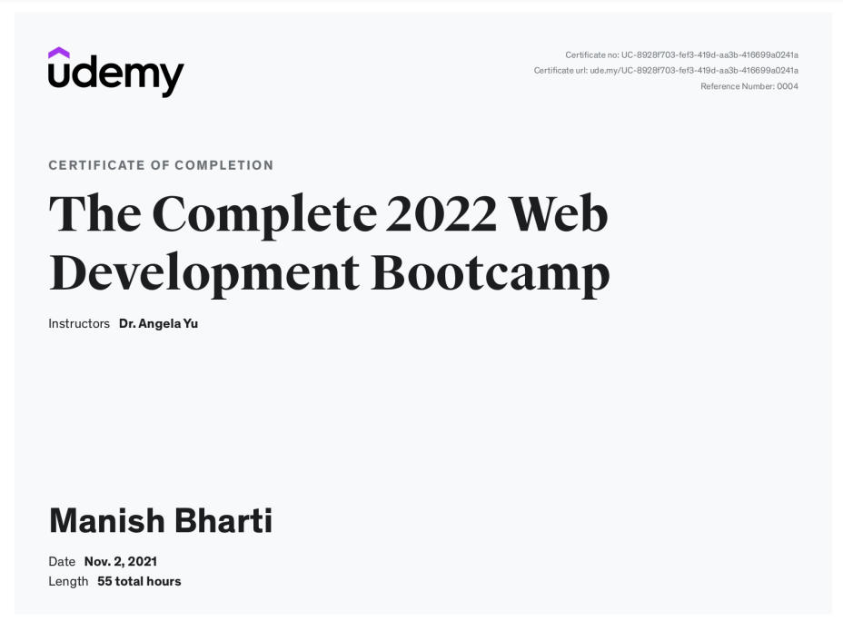

# SysCloud [WebDev Course](https://www.udemy.com/course/the-complete-web-development-bootcamp/) by [Angela Yu](https://twitter.com/yu_angela)

## Certificate

- [The Complete 2022 Web Development Bootcamp
](http://ude.my/UC-8928f703-fef3-419d-aa3b-416699a0241a)

## Projects repo links
- **HTML-CSS**
1. [HTML-PersonalSite](https://github.com/mbharti321/HTML-PersonalSite)
2. [CSS_MySite](https://github.com/mbharti321/CSS_MySite)
   
- **JavaScript**
3. [TinDog](https://github.com/mbharti321/TinDog)
4. [diceeToss](https://github.com/mbharti321/diceeToss)
5. [drumKit](https://github.com/mbharti321/drumKit)
6. [SimonGame](https://github.com/mbharti321/SimonGame)

- **Node.js and API**
7. [weatherCheck](https://github.com/mbharti321/weatherCheck)
8. [newsletter-signup](https://github.com/mbharti321/newsletter-signup)

- **Database-MongoDB**
9.  [TO-Do-List ](https://github.com/mbharti321/TO-Do-List)
10. [TodoList-with-mongoDB](https://github.com/mbharti321/TodoList-with-mongoDB)
    
- **RestFull API**
11. [RESTful-API](https://github.com/mbharti321/RESTful-API)
12. [Blog-with-MongoDB](https://github.com/mbharti321/Blog-with-MongoDB)
    
- **Authentication & security**
13. [Secrets-with-AuthenticationAndSecurity](https://github.com/mbharti321/Secrets-with-AuthenticationAndSecurity)
14. [keeper-ReactJs](https://github.com/mbharti321/keeper-ReactJs)

